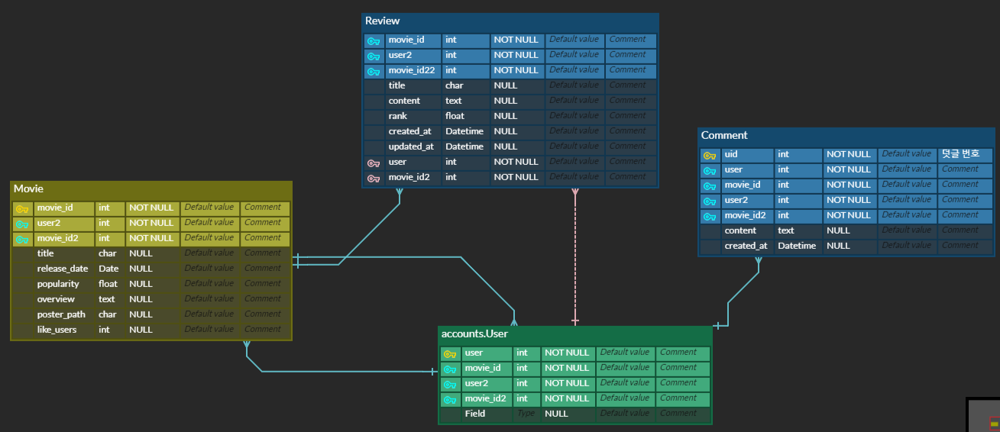

# < Final Project >

> SSAFY 5기 서울 4반 석정준, 서민수의 '수준이준수'팀(이름 끝 글자를 따서 지었습니다...)
>
> 영화 정보 & 영화 추천 웹 서비스 'MOVIE TRIP'


### ✔QuickStart

---

- client

  - `cd client`: client 프로젝트 폴더에 들어간다.

  - `npm install`: 필요한 모듈들을 설치한다.

  - `npm run server`: 서버를 실행한다.

  

- server

  - `cd server`: server프로젝트 폴더에 들어간다.

  - `pip install -r requirements.txt`: 필요한  패키지를 설치한다.
  - `python manage.py migrate`: 모델을 구축한다.
  - `python manage.py loaddata movies/movies.json`: fixtures폴더에 내장된 json파일로 db에 정보를 입력한다.
  - `python manage.py runserver`: 서버를 실행한다.


### 0. 개발 환경 및 툴

---

- **Frontend** : `Vue.js`
- **Backend** : `Django`
- **Database** : `SQLite`
- **Using API** : Tmdb API`, `영화진흥위원회 API`, `OpenLayers API`, `YouTube API`, free reverse Geocording API
- **Development Enviornment** : Windows 10, Node.js 10 or higher, Vue CLI 3 or higher
- **Using Editor** : Visual Studio Code
- **협업 툴** : notion, Google spread sheet


### i. 팀원 정보 및 업무 분담 내역

---

- 팀원정보 : 석정준,  서민수
- 업무 분담 내역(기능별로 업무 분담)
  - 공통 업무 : 웹페이지 기본 틀, 추천 알고리즘 확정, 초기 모델링 구상
  - 석정준 :  Accounts 및  웹페이지 스타일링
  - 서민수 :  Movies, Review, 추천 알고리즘


### ii. 목표 서비스 구현 및 실제 구현 정도 

---

- 목표 서비스

  - api-token을 이용해 Login /  Signup

  - 서버를 구동하면 영화 정보 api로부터 현재 상영중, 인기있는 영화, 평점 높은 영화 정보를 받아 db에 저장하고, 를 tmdb에서 받아서 홈 화면에 출력한다.

  - 영화 상세 정보를 출력한다.

  - 영화별 리뷰 작성/수정/삭제 기능, 찜하기 기능

  - 리뷰별 댓글 작성/삭제 기능

  - 영화 추천 알고리즘:

    - 지도 api를 이용해서 사용자가 선택한 위치의 국가명 정보를 받아온다.

    - 받아온 국가명을 이용해 영화진흥위원회에서 그 국가의 영화 목록을 불러온다.

    - 영화코드를 이용해 영화의 상세정보를 저장하고 그 중에서 랜덤으로 출력한다.

      

- 목표와 다르게 구현된 것
  - 서버를 구동하자마자 영화 정보를 불러오는 기능 구현에 실패하여, 따로 함수를 만들어 db에 저장하도록 했다. (fixtures에 json파일도 생성되도록 하였다.)
  - 찜하기 기능은 다른 필수 기능을 구현하다가 시간이 부족해서 제외하게 되었다.
  - 영화 추천 알고리즘:
    - 지도 api에서 바로 국가 정보를 불러오는 것이 어려워서 Reverse GeoCoding API 를 사용하여 국가명을 불러왔는데, 영진위에서 제공하는 국가명과 상이하여 일부 국가는 요청이 제한되었다.
    - 초기 모델링은 TMDB API 정보를 이용하여 만들었는데, 영진위에서의 영화 정보와 상이했다(포스터 없음, 영화코드가 다름, overview없음). 그래서 기존의 db에 추가해주는 기능은 구현하지 못했고, 영화정보를 출력만 해주도록 하였다.


### iii. 데이터베이스 모델링(ERD)

---




### iv. 필수 기능에 대한 설명

---

- Account

  - Signup

    

    - 초기에는 회원가입 페이지를 이동하면서 진행하도록 구현하였습니다.
    - modal을 이용해 APP.Vue에 연결하여 페이지 전환없이 구현하였습니다.

  - Login

    

    - 초기에는 로그인 페이지를 이동하면서 진행하도록 구현하였습니다.
    - 하지만 사용자 경험을 높이기 위해 modal을 이용하여  페이지 이동없이 구현하는데 노력했습니다.
    - APP.Vue에 연결하여 페이지 전환없이 구현하였습니다.
    - 로그인 이후와 이전은 v-if, v-else를 통해 페이지 구현이 다르게 하였습니다.
    - 인증된 사용자가 로그인 이후에는 `Movie`, `Trip`, `Logout`탭이 등장하게 하였습니다.

  

- Movie

  - MovieList

    

    TMDB API로 요청을 보내 바로 출력해주는 페이지, db에 저장되어 있는 것이 아니기 때문에 movieTitle을 이용해서 상세 페이지로 연결된다.

    ```javascript
    getMovieDetail: function () {
        axios({
            method: 'get',
            url: 'http://127.0.0.1:8000/movies/movie-list/',
        })
            .then(res => {
            const movieList = res.data
            for(var i in movieList) {
                if(movieList[i].title === this.movieTitle) {
                    this.movie = movieList[i]
                    return movieList[i]
                }
            }
        })
            .then(movie => {
            const API_KEY = process.env.VUE_APP_TMDB_API_KEY
            axios({
                method: 'get',
                url: `https://api.themoviedb.org/3/movie/${movie.movie_id}/videos?api_key=${API_KEY}&language=en-US`
            })
                .then(res => {
                if (res.data.results[0]) {
                    this.relatedVideoUrl = 'https://www.youtube.com/embed/' + res.data.results[0].key
                }
            })
        })
            .catch(err => {
            console.log(err)
        }) 
    },

    부트스트랩과 외부 라이브러리를 이용해서 carousel을 만들었다.

    

    db에 저장되어 있는 영화의 전체 목록을 출력하는 페이지, db에 있는 id값을 이용하여 상세페이지로 연결된다.

  - MovieDetail

    

    db에 저장된 정보 및 TMDB와 Youtube API를 이용해 가장 상위의 관련 동영상을 가져왔다. 각 영화별 리뷰 리스트 컴포넌트가 포함되었다.

    

- Community

  - Review

    

    user와 movie를 Foreignkey로 가지고 있으며, 제목, 내용, 평점을 저장하는 기능을 가지고 있다.

  - Comment

    

    user와 review를 Foreignkey로 가지고 있다.

    

- Recommend

  

  - 코로나 시국에 사이버 상으로 영화 여행을 떠나보는 기능
    - OpenLayers API를 이용하여 현재 지도 좌표를 가져온다.
    - 좌표를 이용해서 Reverse GeoCoding API를 이용해 국가명을 구한다.
    - 국가명으로 영진위 API를 이용해 그 국가의 최신 영화 목록을 가져온다.
    - 그 중에서 랜덤으로 하나의 영화정보를 출력한다.


### v. 기타(느낀점)😂😊

---

- 정준: 
  - 관통 프로젝트가 짧은 기간이었지만  시간이 부족하다는 느낌이 너무 많이 들었습니다.  또, 많이 배웠던 시간이었습니다.
  - 문제를 해결하기 위해 밤 늦게까지 하나의 문제에 몰두하며 어떻게 해결해야 되는지 배울 수 있는 시간이었습니다.
  - 실력이 좋았다면 발생된 에러와 문제들을 빠르게 해결하며 프로젝트 진행이 빠르게 할 수 있었겠지만 아직 실력이 부족하다고 느꼈습니다.
  - 팀원인 민수님과 문제없이 프로젝트를 완성할 수 있어서 만족합니다.
  - 개인적으로 django 는 비교적 익숙하고 code를 작성했지만, vue.js가 아직 개념 이해가 낮고 코드 작성이 어려워서 프로젝트에서 어려움을 겪었습니다.
  - vue.js 는 앞으로 공부를 조금 더 해 실력을 키워야 될 것 같습니다.
  - 프로젝트를 하면서 프론트엔드 부분에 대해 흥미를 얻은 것은 큰 성과입니다.  css 적용 및 웹 페이지 layout 변경 등을 하며 변화하는 모습을 보니 이전에 html/css 를 배웠을 때 보다 흥미가 높아졌습니다.


- 민수:

  - 설치된 모듈과 라이브러리가 많을수록 프로그램이 무거워지면서 느려지는 것을 체감하였습니다. 잘못 설치를 했다거나 설치를 했다가 안쓰게 되었을 경우에, 앞으로는 모듈을 바로바로 삭제를 해주어야 그나마 프로그램을 가볍게 유지할 수 있을 것이라고 느꼈습니다.

  - 초기에 모델링을 다 하고 시작을 했는데, 특히 영화 추천 알고리즘을 진행하면서 모델이 유연해야함을 느꼈습니다. 막바지에 시간이 부족해서 모델을 뜯어고치지 못했는데, 그것때문에 추천하는 영화를 db에 저장할 수 없어서 아쉬웠습니다.

  - 외부 라이브러리를 이용할 때 좋은 점도 있었지만, 이걸 어떻게 사용하는 것인가에 대해 어려움을 많이 느꼈습니다. 앞으로 익숙해져서 능숙하게 사용할 수 있으면 좋겠습니다.

  - 아직 개발 언어에 익숙하지 않은 시점에서 코드를 마구잡이로 작성하다보니 vuex를 사용하지 않으며 코딩을 했습니다. 이로인해 중복되는 코드가 많아져서 코드 가독성이 많이 떨어졌습니다. 그래도 이해도가 높아진 현 시점에서 만약 새 프로젝트를 하게된다면 vuex와 같은 모듈을 더 잘 이용할 수 있을 것 같습니다.

  - 페어인 정준님과 오랫동안 같이 협업을 하면서 원래 자신 없었던 커뮤니케이션 능력에 자신감이 조금은 생긴 것 같습니다. 그리고 서로의 코드를 공유하는 과정에서 코드 리뷰 능력이 많이 향상되었다고 생각합니다.

    

### vi. 겪었던 에러🤢

---

- 정준:

  - APP.Vue에 Login.vue, Signup.vue 를 modal 연결하는 것

    - 시간을 정말 많이 쏟았던 것
    - data에 추가해줘야하고 id 이름을 다르게!

  - 초기 community folder에 리뷰, 댓글 기능을 노력했지만 잘 안된 것

  - 소셜 로그인 적용(구글)

    - django에 적용했던 경험을 바탕으로 진행하고 이전 live 강의를 보며 진행했지만 vue와연결이 어려웠고 vue에서 따로 하는 것이 있어 npm 설치 등을 통해 진행했지만 실패.
    - 다음에는 꼭 성공 목표

  - footer 하단 고정

    - 다양한 방법이 있어 오히려 헤맸던 기능.

  - 토글이 되어 모달이 될 때 오버레이 z-index 조절하기

    - 회원가입, 로그인 부분에서 기능이 정상 작동되었지만 movie_img와 겹치는 문제
    - 민수님의 도움으로 z-index를 통해 해결할 수 있었습니다.

  - 상위 폴더로 접근하는 것에 대해 문제를 겪었습니다.

    - ```html
      from ..Movie import movie
      from .Movie import movie
      ```

    - 위와 같은 참조를 해서 교수님께도 물어보고 잠시 됐지만 다시 안되서 모델을 바꿔서 진행했습니다. 아직도 잘 모르겠고 이걸로 5~6시간을 사용했습니다.

  - modal에 대한 이해도 상승 및 다른 페이지 연결할 때 data에 꼭 넣어줘야 한다!

  - ```html
    <a @click="$router.go(-1)" class="text-light fas fa-arrow-left col-1"></a>
    ```

  - 위를 통해 뒤로 버튼을 구현할 수 있었고 router-link를 통해 페이지 이름을 넣지 않고 빠르게 해결 할 수 있었습니다.

  - 401 error unauthenticate error 에러와 해결 방법에 대해 많이 배울 수 있었습니다.

  - 비밀번호 * 표시 하는 것은 input tag에서 type="password" 해야됨 text로 하니 보인것

    - 아는 것도 정확히!


- 민수:

  - 덤프데이터 생성

    `python manage.py dumpdata movies > movies.json`

    덤프데이터를 생성하려고 했으나 이런식으로 오류가 떴다....

    

    아마도 한글로 되어있는 json파일 이라서 이러한 오류가 발생하는 것 같았다. 정말 오래 헤매다가 준규님과 송현님이 mm에 올린 코드를 보고 힌트를 얻어서 이런 식으로 코드를 고쳤다.

    ```python
    results = []
    
    # data 받아오기
    my_url = 'https://api.themoviedb.org/3/movie/popular?api_key=4dc86c92c350c5edac0c712116558e11&language=ko-KR'
    response = requests.get(my_url)
    movie_dict = response.json()
    
    # 필요한 정보 골라내기
    movie_list = movie_dict.get('results')
    for movie in movie_list:
        title = movie.get('original_title')
        overview = movie.get('overview')
        release_date = movie.get('release_date')
        poster_path = movie.get('poster_path')
        popularity = movie.get('popularity')
    
        # # DB에 저장하기, 중복제거
        # (movie, created) = Movie.objects.get_or_create(title=title, overview=overview, release_date=release_date, poster_path=poster_path, popularity=popularity)
    
        results.append({
            'model': "movies.movie",
            'pk': len(results) + 1,
            "fields": {
                'poster_path': 'https://image.tmdb.org/t/p/w500//' +  poster_path,
                'title': title,
                'overview': overview,
                'release_date': release_date,
                'popularity': popularity
            }})
    ```

    그리고 pprint를 사용하여 출력하니 원하는 형식으로 출력할 수 있었다!

    

    그러나 줄이 바뀌어서 출력되어 중간에 따옴표가 생겨서 json파일이 오류가 났다 ㅠㅠ 그래서 준규님 코드를 그대로 활용해보니, json파일이 저절로 만들어지기는 하였다.

    

    줄바꿈이 되지 않아서 알아보기 힘들긴 하지만, 그래도 정상적으로 작동하였다! json파일 만드는 것이 이렇게 시간을 오래 잡아먹을 줄은 몰랐다. 정말 힘이 빠진다...

    

  - 로고 삽입

    - 인터넷 상에서 적절한 로고를 하나 따와서 로고를 넣어주려고 했는데 계속 `Module parse failed: Unexpected character '�'`라는 에러가 떴다.... 알고보니 PNG가 대문자로 되어있어서 그런 것이었다. 소문자로 바꿔주니 잘 작동하였다...

    - 로고를 누르면 홈으로 가게 하는 코드는 이렇다

      `<router-link :to="{ name: 'Home'}"></router-link>`

      

  - 전체 영화 페이지

    전체 영화를 보여주는 Movies 페이지와 그 안의 영화 하나 하나를 구성하는 MoviesCard를 만들었는데, 계속해서 이런 오류가 났다.

    한참을 해맸는데, 결국 부트스트랩에서 긁어온 코드에 `...`이 그대로 남아 있어서 그런 것 이었다. 진짜 한시간 정도 헤맨거 같은데 너무 허무했다 ㅠㅠ

    ```vue
    <template>
      <div class="card">
        
        <div class="card-body">
          <h5 class="card-title">Card title</h5>
          <p class="card-text">This is a wider card with supporting text below as a natural lead-in to additional content. This content is a little bit longer.</p>
          <p class="card-text"><small class="text-muted">Last updated 3 mins ago</small></p>
        </div>
      </div>
    </template>
    ```

    이후로는 그래도 빨리 만들수 있었는데, 전체 영화 목록 순서를 이름순, 평점 순 등으로 나열할 수 있으면 정말 좋을 것 같았다. 그러나 시간이 너무 오래 걸릴 것 같아서 일단 기본 기능을 다 끝내고 추가 기능을 해야할 것 같다.

    

  - 영화 상세보기 페이지 구성

    - 영화 관련 동영상들을 불러오기 위해서는 tmdb에 저장된 movie의 id값이 필요했는데 모델에서 받아오지 않은 것을 발견하고 급하게 수정했다.

    - 영화 이름으로 sqlite에 있는 영화 정보를 찾고, 그 다음 영화 아이디를 이용해 tmdb에 요청을 보내는 과정에서 이러한 에러가 떴다.

      

      웹페이지에는 정상적으로 출력이 되는데도 불구하고 왜 이런 에러가 뜨는 걸까? ㅠㅠ

      ```javascript
        created: function () {
          this.getMovieDetail()
          this.getMovieVideo()
        }
      ```

      created에 두가지 함수를 모두 써서 그런가 했지만 그것도 아닌 것 같았다. mounted로 `getMovieVideo()`를 옮겼는데도 똑같은 에러가 발생했기 때문이다.

      ```javascript
      getMovieVideo: function () {
            const API_KEY = process.env.VUE_APP_TMDB_API_KEY
            console.log(this)
            console.log(this.movie)
            axios({
              method: 'get',
              url: `https://api.themoviedb.org/3/movie/${this.movie.movie_id}/videos?api_key=${API_KEY}&language=ko-KR`
            })
              .then(res=> {
                console.log(res)
              })
              .catch(err => {
                console.log(err)
              })
          }
      ```

      

       console.log로 찍어봤을때 this는 잘 출력이 되는데 this.movie는 저장한 값이 뜨지 않고 Observer라는 형식으로 뜨는데 왜 그런지 도저히 모르겠어서 mm에 질문을 남겼다. 교수님의 말씀에 따라서 함수를 하나로 합쳐보니 드디어 요청이 보내졌다. 

      ```javascript
      getMovieDetail: function () {
          axios({
              method: 'get',
              url: 'http://127.0.0.1:8000/movies/movie-list/',
          })
              .then(res => {
              const movieList = res.data 
              // console.log(movieList)
              for(var i in movieList) {
                  if(movieList[i].title === this.movieTitle) {
                      this.movie = movieList[i]
                      return movieList[i]
                  }
              }
          })
              .then(movie => {
              const API_KEY = process.env.VUE_APP_TMDB_API_KEY
              console.log(movie)
              axios({
                  method: 'get',
                  url: `https://api.themoviedb.org/3/movie/${movie.movie_id}/videos?api_key=${API_KEY}&language=ko-KR`
              })
                  .then(res => {
                  console.log(res)
              })
          })
              .catch(err => {
              console.log(err)
          }) 
      },
      ```

      하지만 아직까지도 왜 data에 담긴 movie가 undefined로 바뀌는지는 알 수가 없다...😢🤷‍♀️

      

  - create review

    

    코드가 다 맞는거 같은데 이런 에러가 떴다. 한참 헤매다가 serializer문제라는 것을 깨달았다. `read_only_fields`에 `user`와 `movie`를 둘 다 넣었던 것이다. movie는 create시 등록해야하는데 말이다.

    ```python
    class ReviewSerializer(serializers.ModelSerializer):
    
      class Meta:
        model = Review
        fields = '__all__'
        read_only_fields = ('user',)
    ```


  - create comment

    - 댓글을 등록한 뒤에 페이지를 새로고침하여 보여주고 싶었다. 그래서 `location.reload();`를 처음에 사용했는데, 이는 전체 페이지를 새로고침해서 보기가 안좋았다. 댓글이 달린 부분만 새로고침할 수 있으면 좋을 것 같았다. 수업시간에 장고에서 이러한 방법을 다뤄봤는데, Vue에서는 써보지 못한 것 같아서 문서를 찾아보았는데, 이 기능을 구현하려면 `jQuery`를 이용해야했다.

      스택오버플로우를 참고하여 다음과 같이 설치해주고,

      `npm install jquery`

      사용할 파일에서 `import $ from 'jquery'`를 해주었다.

      그 다음 검색 결과대로 `$("#commentReload").load(window.location.href + "#commentReload"); `를 해주었는데도 전체 페이지가 새로고침 되었다.... 왜 그런지 모르겠다. 문제는 그 아이디를 가진 영역 안에 있는 댓글의 생성 및 수정 시간도 같이 바뀌는 것이었다. 그래서 그냥 페이지 새로고침으로 바꿔주고, 제이쿼리는 삭제했다...

      

    - !!!! 근데 생각해보니 이미 있는 함수인 getCommentList를 다시 실행해주면 될것 같아서 그렇게 했더니 됐다! 😁😁😁😁 삭제시에도 하위 컴포넌트인 CommentListItem에서 상위 컴포넌트인 CommentList로 emit을 통해 이벤트를 전달하고 이벤트를 받아서 getCommentList함수를 실행하게 하는 방식으로 적용했다.

    

### vii 버그, 앞으로 개선해야할 점💥

---

- 창 크기가 변함에 따라 UI가 깨지는 경우가 있습니다.
- 리뷰나 댓글을 쓴 유저가 아니더라도 수정/삭제 버튼이 보여지고 있습니다.
- 서버가 시작되면 자동으로 최신 정보를 불러오고 db에 저장하고 싶은데 잘 안되고 있습니다.
- 로그인, 회원가입 부분에서 keyup.enter 넣는 것 고려
- modal 떴을 때 뒷 배경 음영되기
- alert로 아이디, 비밀번호를 입력해주세요, 틀렸습니다. 기능 추가로 사용자 경험 높이는 것
- trip 페이지에서 accordian부분을 조금더 이쁘게 해보고 싶습니다. modal로 변경하는 등

